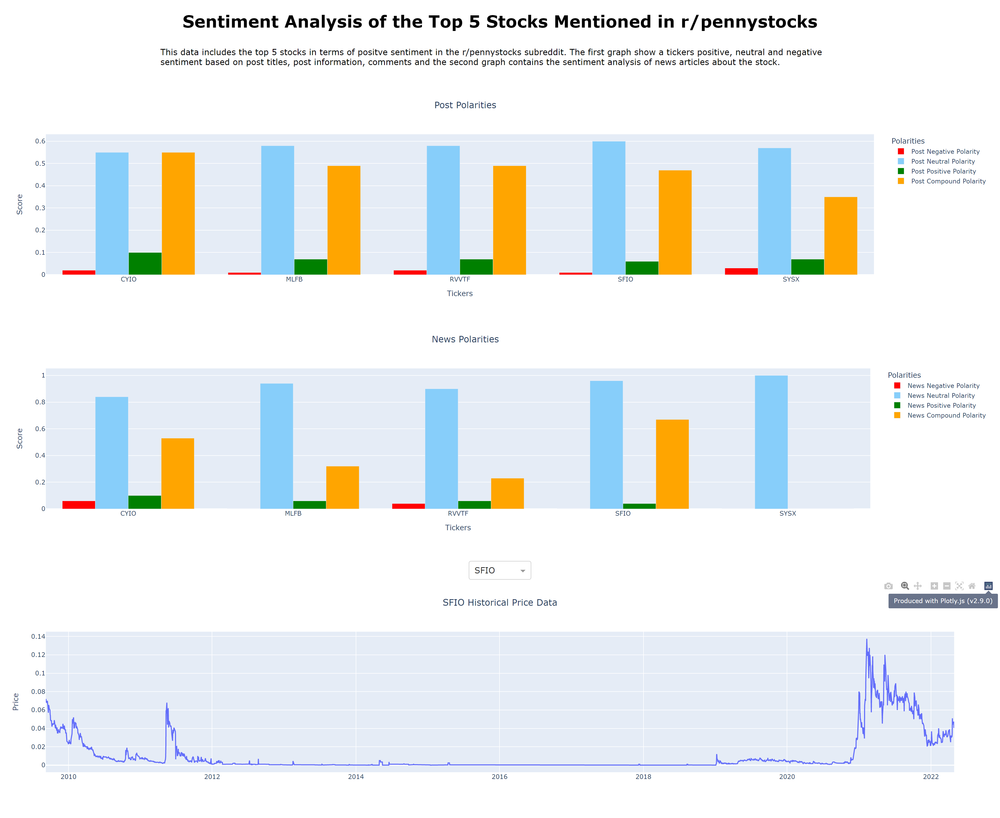

# Penny Stock Sentiment Analysis

A sentiment analysis dashboard of positively mentioned stocks in r/pennystocks. The data
is scraped from posts in r/pennystocks using, PRAW, a Reddit API wrapper and the sentiment scores are collected using VADER sentiment analysis. The 5 stocks with the highest positive polarity are plotted using Dash Plotly, along with the sentiment scores of news articles for each stock using the yfinance API and the historical price chart.
\
\


## Installation

1. Get a free API key from https://www.reddit.com/prefs/apps
2. Install the package with the following command:
```
pip install git+https://github.com/suada-a/
penny-stock-sentiment-analysisgit#egg=penny-stock-sentiment-analysis
```
3. Enter API keys and Reddit credentials in config.py:
```
reddit_key = 'your_key'
reddit_secret = 'your_secret_key'
username = 'your_username'
password = 'your_password'
```

## Built With
- Dash Plotly
- Pandas
- Praw
- Vader Sentiment
- yfinance

## License
The project is licensed under the MIT license - see [LICENSE.txt](./LICENSE.txt)

